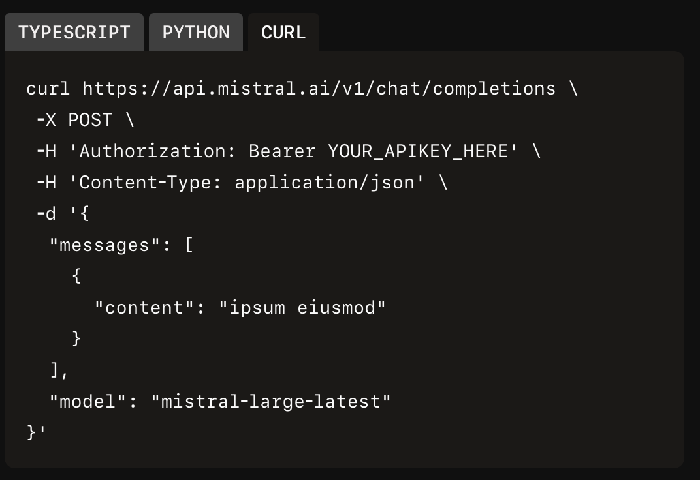

# IntelliVerse_task
Roman task: Deploy on PythonAny. a simple chatbot 
Whats asked?
- Create a simple chatbot
- Using API and multiple LLM providers (Mistral and OpenRouter)
- Return model answers via Basic UI (Jinja? basic html?)
- Share a Link on Telegram to @rmant7

Whats not being asked!
-  A mobile App
-  Fancy UI
-  Conversation Memory
-  Authentication

KISS: 
- Backend: Python + Flask
- FrontEnd: simple html (Jinja)
- Deploy Pythonanywhere!

How to keep it simple?
- Single Page with Text Input / User prompt
- Dropdown menu 1. Mistral 2. OpenROuter
- Submit Button
- Response display

Backend Logic: 

User submits prompt + model choice
↓
Flask route receives request
↓
If model == "mistral":
    call Mistral API
Else if model == "openrouter":
    call OpenRouter API
↓
Return response text
↓
Render it in HTML

## Topics to Read about:
Requests (Pip install)
https://docs.python-requests.org/en/latest/user/quickstart/#more-complicated-post-requests

## TODO 

- [x] create virtual environment
- [x] Install flask
- [x] check if flask is installed and working
- [x] create a simply route 
- [x] create a templates folder
- [x] create index.html
- [x] render index.html

- [x] create function for mistral
- [x] create the calls for mistral
    - [x] Read the ChatCompletions in Mistral
    - [x] Implement role, content
    - [x] Implement endpoints
    - [ ] test endpoints

    

- [x] create function for openrouter
- [x] create the calls for OpenRoute
    - [ ] Read the Doc OpenRoute
    - [ ] Implement role, content
    - [ ] Implement endpoints
    - [ ] test endpoints
    
